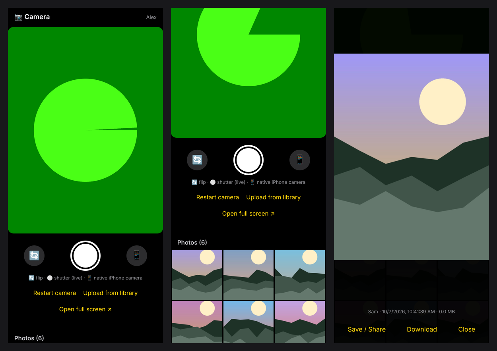

# Example Camera Photo Gallery

No launch link: point PromptQL to this repo to build the app.

The bot runs a camera app with a shared photo gallery on its VM, published as an app artifact. Everyone in the bot opens the same app on their phone, takes photos, and sees each other's photos in one gallery.

## How to use it

- **Live camera:** open the app on your phone and tap **Start live camera**. You get a live viewfinder in the app. Tap 🔄 to switch between the front and back camera, and the shutter to take a photo.
- **Phone camera:** tap 📱 to take a photo with your phone's own camera app instead.
- **Library:** tap **Upload from library** to add photos you already have. iPhone HEIC photos are converted to JPEG.
- **Gallery:** every photo shows up for everyone in the bot. Tap a photo to **Save / Share** it through your phone's share sheet, or to **Download** it. Only the person who took a photo can delete it.

### Why the live camera is not available in the embedded view

The app view inside the chat is an embedded frame that is not granted camera permission (the `allow="camera"` permission policy), so the browser blocks the live camera there. Tap **Open full screen ↗** to use the live camera, or use 📱 for your phone's camera app, which works everywhere.

## Example outcome

The live viewfinder, the shared gallery, and a photo opened from the gallery:

The screenshots use a simulated camera and generated sample photos.

## Files

- `PROMPT.md`: the short prompt you send to start the bot.
- `BOT.md`: the full instructions the bot follows.
- `app/`: the app the bot deploys as-is. It is plain Python 3 with SQLite and a single HTML page, with no dependencies.